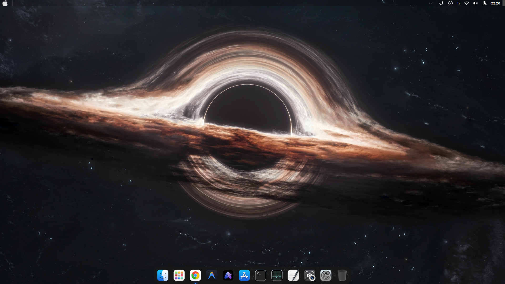
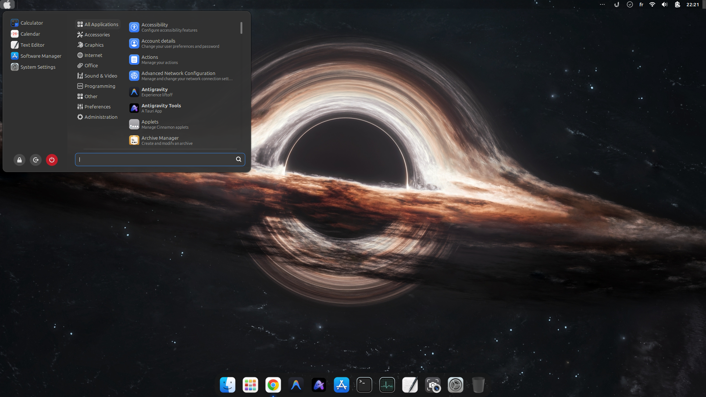
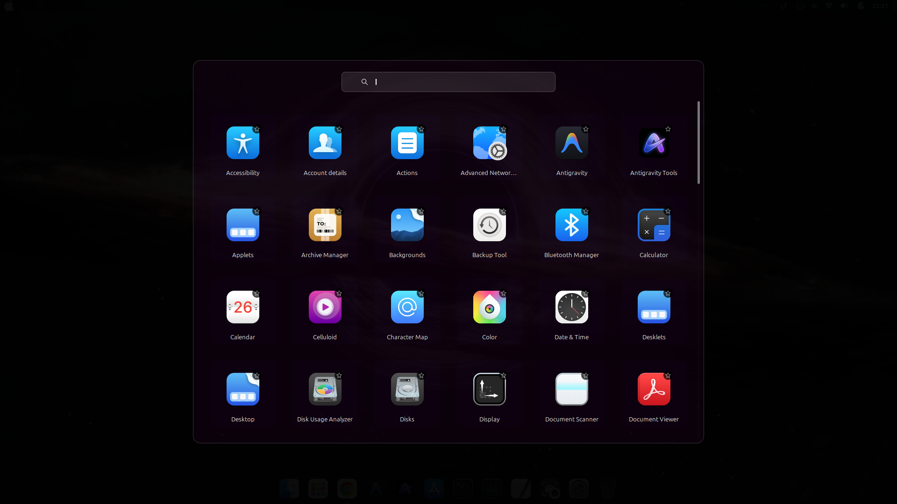

# 🍎 MintMac

> A macOS-style desktop experience built on **Linux Mint 22.3 Cinnamon**


---
## 📸 Screenshots




---

## ✨ Features

- 🎨 **WhiteSur GTK Theme** — Dark macOS-style window decorations
- 🗂 **WhiteSur Icons** — macOS-style icon pack
- 🖱 **WhiteSur Cursors** — macOS cursor theme
- 🚀 **Plank Dock** — macOS-style bottom dock with autohide
- 🔍 **Ulauncher** — Spotlight-style app search (Ctrl+Space)
- ⚡ **Optimized performance** — GPU acceleration disabled for stability on older hardware
- 🌡 **TLP** — Power management for better thermals
- 📹 **VA-API** — Hardware video decoding via Intel integrated GPU

---

## 🖥 Tested Hardware

| Component | Spec |
|-----------|------|
| Laptop | MSI GT780 |
| CPU | Intel Core i7-2630QM |
| RAM | 8GB |
| GPU | NVIDIA GT 560M + Intel HD 3000 |
| Storage | 500GB SSD |

Works well on similar **Sandy Bridge era (2011-2013)** laptops.

---

## 🚀 Quick Install

### Requirements
- Fresh **Linux Mint 22.3 Cinnamon** install
- Internet connection
- `git` installed

### Run Setup Script

```bash
git clone https://github.com/yourusername/MintMac.git
cd MintMac
chmod +x setup.sh
./setup.sh
```

Then **reboot** when done.

---

## 📦 What Gets Installed

| App | Purpose |
|-----|---------|
| WhiteSur GTK theme | macOS window style |
| WhiteSur icons | macOS icons |
| WhiteSur cursors | macOS cursor |
| Plank | macOS-style dock |
| Ulauncher | Spotlight search |
| TLP | Power/thermal management |
| VA-API drivers | Hardware video decode |

### Not Included (install manually)
- Google Chrome → [chrome.google.com](https://chrome.google.com)
- Google Antigravity → [antigravity.google](https://antigravity.google)
- VSCode → [code.visualstudio.com](https://code.visualstudio.com)

---

## ⌨️ Keyboard Shortcuts

| Shortcut | Action |
|----------|--------|
| `Ctrl+Space` | Open Ulauncher (Spotlight) |
| `Super` | Show all windows |
| `Super+D` | Show desktop |

---

## 🔧 Manual Steps After Install

### 1. Apply theme in Themes settings
Open **Menu → Themes** and set:
- Window borders → `WhiteSur-Dark`
- Icons → `WhiteSur-dark`
- Controls → `WhiteSur-Dark`
- Mouse pointer → `WhiteSur-cursors`
- Desktop → `WhiteSur-Dark`

### 2. Start Plank dock
```bash
plank &
```
Right-click the dock → Preferences to customize.

### 3. NVIDIA driver (optional)
If you have a **GTX 900+** series GPU:
```bash
sudo apt install nvidia-driver-535
```
For older cards (GT 560M etc.) — **Nouveau driver works fine** for desktop use.

---

## 🐧 Base System

- **OS:** Linux Mint 22.3 "Zena" Cinnamon
- **Kernel:** 6.8.x LTS
- **Base:** Ubuntu 24.04 Noble
- **Support until:** April 2029

---

## 📝 License

MIT License — free to use, modify and share.

---

## 🙏 Credits

- [WhiteSur Theme](https://github.com/vinceliuice/WhiteSur-gtk-theme) by vinceliuice
- [WhiteSur Icons](https://github.com/vinceliuice/WhiteSur-icon-theme) by vinceliuice
- [Plank](https://launchpad.net/plank)
- [Ulauncher](https://ulauncher.io)
- [Linux Mint](https://linuxmint.com)
